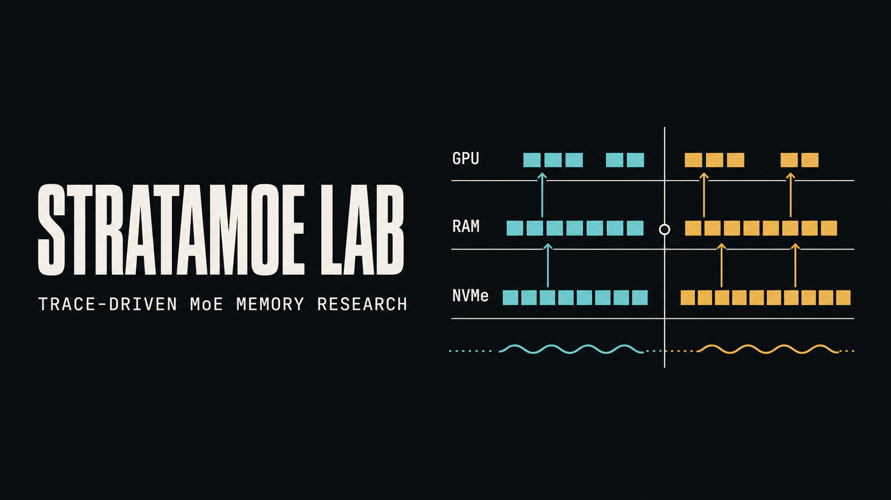
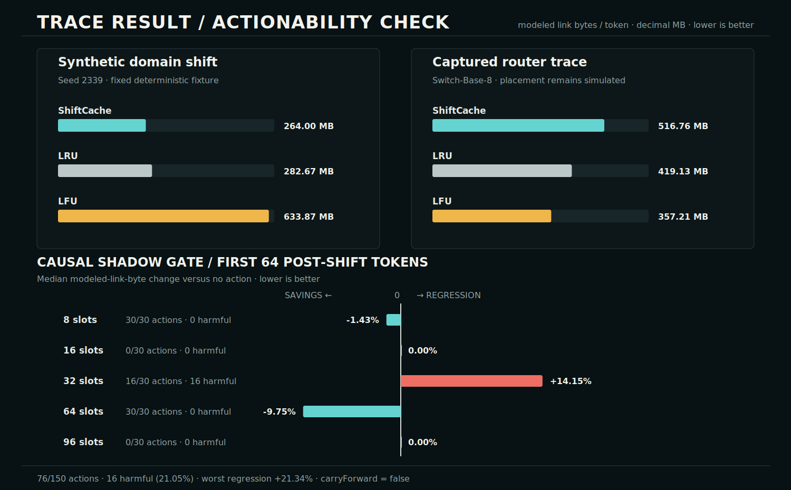

# StrataMoE Lab



**A deterministic, trace-driven simulator for studying expert placement across GPU, RAM, and NVMe under changing Mixture-of-Experts workloads.**

I built StrataMoE Lab to investigate one deliberately narrow question:

> Can router-distribution change signals improve expert placement after workload shifts, compared with LRU and LFU, without changing the router's selected experts?

The repository implements an inspectable experiment, not a production inference engine. It replays synthetic or imported router traces through a modeled memory hierarchy and compares three policies on the exact same expert selections:

- **LRU** keeps the most recently used experts.
- **LFU** keeps the most frequently used experts over the run.
- **ShiftCache** compares recent and longer-horizon activation distributions with Jensen-Shannon divergence (JSD), can continuously reweight historical frequency, recent frequency, and recency, and can add observed one-step transition scores. An opt-in persistent detector can gate a fixed intervention; its preregistered test failed the traffic gate.

Every policy moves the requested expert weights; none may replace, skip, reroute, or silently lower the precision of a selected expert. `semanticRoutingChanges` should therefore remain zero.

## Status and claim boundary

| This repository does | This repository does not do |
| --- | --- |
| Generate deterministic traces and include one pinned real-model router capture | Execute a checkpoint inside the browser dashboard |
| Import and export provenance-bearing router traces as JSON | Measure a physical GPU, PCIe bus, RAM subsystem, or SSD |
| Model GPU/RAM/NVMe residency and transfers | Run CUDA kernels, DMA, decompression, or quantized matrix multiplication |
| Compare policies on identical routing decisions | Establish model-quality preservation on generated text |
| Report exact simulator counters and bandwidth-derived estimates | Claim a real tokens-per-second speedup or a new state of the art |

I report results in this form: **“On trace T under configuration C, policy A
reduced simulated bytes per token by X% relative to policy B.”** I do not turn a
simulator result into a hardware-speed claim. See
[Methodology](docs/METHODOLOGY.md) and [Limitations](docs/LIMITATIONS.md).

## Evidence at a glance



The upper panels contrast one fixed synthetic trace with the pinned
Switch-Base-8 router capture. The lower panel reports the preregistered
actionability sweep: negative values mean fewer modeled link bytes than no
action, while positive values mean a regression. The candidate helped only in
narrow capacity regimes and failed its safety and coverage gates, so
`carryForward = false`. Router selections are unchanged throughout; none of
these values are hardware measurements.

Regenerate the figure with `npm run evidence:render`; `npm run evidence:check`
fails if the SVG no longer matches the executable benchmark and checked-in
evidence.

## Fixed regression benchmark

`npm run benchmark` currently reproduces the synthetic `domain-shift` RouterTrace v2 with seed `2339` and provenance-bearing fingerprint `d860285d` (`240` tokens, `8` layers, `16` experts per layer, top-`2`, `32` GPU slots, `64` RAM slots, `64` MB experts, `24` GB/s PCIe, and `7` GB/s NVMe).

| Policy | Total modeled link bytes / token | Modeled transfer stall / token | Estimated throughput |
| --- | ---: | ---: | ---: |
| ShiftCache | 264,000,000 B | 13.7254 ms | 50.6961 tok/s |
| LRU | 282,666,666.67 B | 14.5032 ms | 48.7729 tok/s |
| LFU | 633,866,666.67 B | 29.4063 ms | 28.2435 tok/s |

On this one checked-in synthetic fixture, ShiftCache moves **6.60% fewer modeled link bytes** and has **5.36% less modeled transfer stall** than LRU. Prefetch traffic is included, and all policies report `semanticRoutingChanges = 0`. This is a deterministic regression result, not evidence of general superiority or measured hardware speed.

## First captured-router result

The pinned Switch-Base-8 trace is deliberately reported even though it is a
failure case for ShiftCache. Under the fixed captured-trace configuration, LFU
used `357,209,302.33` modeled link bytes per token, LRU used `419,125,581.40`,
and ShiftCache used `516,762,790.70`. ShiftCache was therefore **44.67% worse
than LFU by modeled bytes** on this trace. Its transition prefetcher used only
108 of 366 issued prefetches. Router selections are captured model outputs;
memory traffic and timing remain simulated. See the full [capture and replay
record](docs/CAPTURED_SWITCH_TRACE.md).

The first mechanism ablation keeps ShiftCache's JSD signal and retention scoring
fixed while disabling transition prefetch. On the same trace, modeled link
bytes fell from `516,762,790.70` to `411,088,372.09` per token (**20.45%**),
and modeled transfer stall fell **15.69%**. The no-prefetch control was still
**15.08% worse than LFU**, so this result identifies prefetch pollution without
establishing that the remaining ShiftCache policy is generally competitive.

The next no-prefetch 2×2 ablation separates continuous JSD reweighting from
transition retention. Relative to fixed frequency/recency scoring, JSD alone
increased whole-run modeled link bytes by **4.31%** and first-32-token
post-boundary bytes by **5.49%**. Transition retention alone reduced them by
only **0.52%** and **1.33%**, respectively. It was the best ShiftCache variant
but still moved **11.50% more whole-run modeled bytes than LFU**. On this trace,
JSD reweighting is negative evidence, not a result to promote as a win.

A preregistered 30-seed synthetic sanity sweep then added three-token
persistence, a 64-token cooldown, and a fixed 64-token event-gated intervention.
It detected all 30 known midpoint shifts after six tokens and produced zero
stationary false triggers, but it **increased** first-64-token post-shift modeled
link bytes by a median **11.52%**; the paired-bootstrap 95% interval was
**[+10.78%, +12.64%]**. The traffic gate failed, so this JSD-gated retention
intervention is not being carried into ShiftQ-MoE.

## Shift actionability pilot

The next experiment asked whether a causal 12-token shadow replay could decide
when that frozen action was worth applying. Its protocol was published before
30 new seeds were run across five GPU capacities. The detector again found all
30 controlled shifts and produced no stationary events.

The actionability candidate still failed carry-forward. It acted in 76 of 150
abrupt cells; 16 actions were harmful (**21.05%**) and the worst regression was
**21.34%**. A narrow 64-slot subset did show a median **9.75%** traffic
reduction with a seed-cluster bootstrap 95% interval of **[9.45%, 10.32%]
savings**, but all oracle-actionable cells came from that single capacity and
LRU remained substantially better there. The frozen protocol required coverage
across at least three capacities, at most 10% harmful actions, and no regression
above 2%, so `carryForward = false`.

This is evidence that actionability depends on cache pressure and timing, not a
validated new policy. See the [frozen protocol](docs/ACTIONABILITY_PROTOCOL.md)
and [complete result](docs/ACTIONABILITY_RESULTS.md).

## Why this experiment exists

[Colibrì](https://github.com/JustVugg/colibri) demonstrates a real VRAM/RAM/storage hierarchy, per-layer caching, pinned hot experts, and live placement policies while preserving router semantics by default. [MoE-Infinity](https://arxiv.org/abs/2401.14361) studies request-level activation traces, predictive caching, and recovery after task or dataset shifts. [DALI](https://arxiv.org/abs/2602.03495) already proposes workload-aware cache replacement, and Colibrì now documents an LFRU-style live placement policy. Those systems make a broad “first workload-aware MoE cache” claim indefensible here.

StrataMoE Lab instead contributes a small, reproducible surface for isolating one hypothesis: whether **router-distribution change signals** can help a non-semantic placement policy recover from abrupt shifts in a controlled trace. The first captured trace is a negative result for continuous JSD reweighting, and the preregistered synthetic sweep is a negative result for the tested event-gated intervention. Scientific novelty would still require a new out-of-sample hypothesis, multiple real router traces, stronger baselines, hardware measurements, ablations, and statistical replication.

## Quick start

Requires Node.js `>=22.13.0`.

No model weights, GPU, API key, or external dataset are required. The included
simulator and deterministic traces run locally.

```bash
git clone https://github.com/Labeeb2339/stratamoe-lab.git
cd stratamoe-lab
npm ci
npm run dev
```

Open [http://localhost:3000](http://localhost:3000) to use the dashboard. Stop
the development server with `Ctrl+C` when finished.

Quality and experiment commands are declared in `package.json`:

```bash
npm run check
npm run benchmark
npm run benchmark:captured
npm run benchmark:captured:prefetch
npm run benchmark:captured:retention
npm run benchmark:detector
npm run benchmark:actionability
npm run benchmark:actionability:verify
```

The dashboard lets you choose a scenario, seed, token count, model shape, cache capacity, expert size, and modeled bandwidths; run all policies; inspect per-token behavior and final tier residency; and export or import deterministic router traces.

RouterTrace v2 records `source.kind` as either `synthetic` or `captured`. Captured traces must pin immutable model and tokenizer revisions, software versions, capture settings, and either ordered dataset example IDs or the SHA-256 of an external prompt manifest. Provenance is included in the trace fingerprint. Legacy v1 files still import, but are conservatively marked as synthetic because they contain no evidence of how their selections were obtained. See the [RouterTrace v2 schema](docs/ROUTER_TRACE_SCHEMA.md).

The first checked-in captured trace comes from pinned `google/switch-base-8` encoder routing: `215` non-padding token positions, `6` sparse layers, top-`1`, and `8` experts per layer. The capture script, non-private prompt manifest, hashes, and replay output are documented in [Captured Switch-Base-8 router trace](docs/CAPTURED_SWITCH_TRACE.md). Its router IDs are real model outputs; all memory and timing numbers produced by StrataMoE remain simulated.

## Reproducible comparison checklist

When reporting a result, include:

1. repository commit;
2. trace source, scenario, seed, and token count;
3. all model-shape and memory-tier parameters;
4. short/long window and shift-threshold settings, if configurable;
5. absolute metrics for every policy, not only the best relative percentage;
6. confirmation that every policy replayed the same trace and reported zero semantic routing changes; and
7. an explicit `simulated` or `modeled` label on bytes, stalls, and throughput.

## Research notes

- [Methodology](docs/METHODOLOGY.md) — experiment design, metrics, equations, and validation plan
- [Related work](docs/RELATED_WORK.md) — primary papers and official repositories, including work from Chinese universities and labs
- [Limitations](docs/LIMITATIONS.md) — what the simulator cannot support as a claim
- [Captured Switch-Base-8 trace](docs/CAPTURED_SWITCH_TRACE.md) — pinned model execution, provenance, reproduction, and replay boundary
- [Preregistered detector sanity sweep](docs/DETECTOR_SANITY.md) — frozen gates, per-seed synthetic result, and failed carry-forward decision
- [Shift actionability protocol](docs/ACTIONABILITY_PROTOCOL.md) — untouched seeds, causal decision rule, metrics, and frozen gates
- [Shift actionability result](docs/ACTIONABILITY_RESULTS.md) — capacity-dependent outcome, byte-identical evidence, and failed carry-forward decision
- [ShiftQ-MoE research plan](docs/SHIFTQ_MOE_RESEARCH_PLAN.md) — closest prior work, candidate method, baselines, ablations, and strict go/no-go gates

[RouterTrace v2 schema](docs/ROUTER_TRACE_SCHEMA.md) documents synthetic/captured provenance, validation, privacy, and v1 migration.

## Research roadmap

1. **Trace harness:** deterministic synthetic traces, inspection UI, fixed regression benchmark, and honest modeled metrics.
2. **Real-trace replay:** collect router IDs from multiple open MoE families and compare stronger activation-aware baselines.
3. **Runtime validation:** integrate a frozen policy into one open runtime and measure actual traffic, TTFT, TPOT, and energy on named hardware.
4. **Actionability study:** the first causal shadow gate is frozen after its preregistered safety and coverage gates failed, despite a narrow positive capacity regime.
5. **Precision study:** paused for the current JSD-gated design. Any future precision study must begin as a separately registered static sensitivity baseline or supply new out-of-sample evidence before reviving a shift-triggered claim.

The source code is licensed under the [Apache License 2.0](LICENSE).

StrataMoE Lab is independent educational research. It is not affiliated with Colibrì, AirLLM, the cited authors, their universities, or their organisations.
